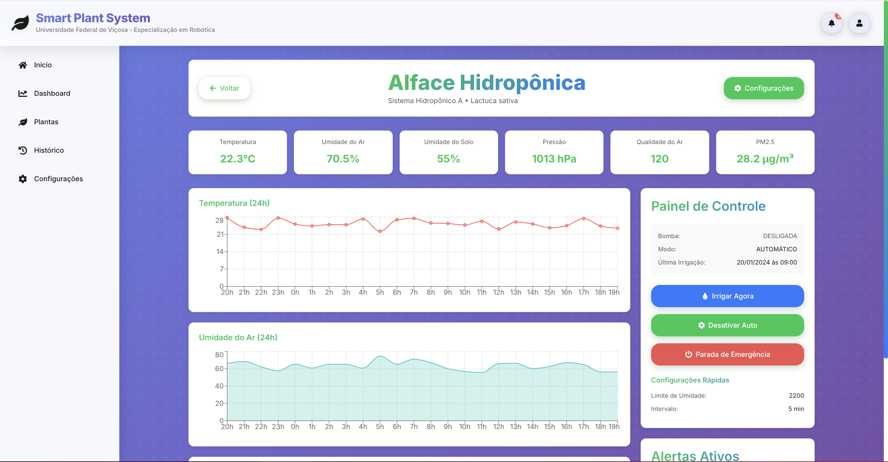

# 🌱 Smart Plant System - Sistema Inteligente de Irrigação IoT

[](https://reactjs.org/)
[](https://fastapi.tiangolo.com/)
[](https://www.python.org/)
[](https://vitejs.dev/)
[](LICENSE)

## 📋 Descrição

O **Smart Plant System** é um protótipo eletromecânico completo que automatiza a irrigação de plantas através de sensoriamento de umidade do solo, integrando monitoramento ambiental completo e visualização remota via plataforma web. Desenvolvido para o curso de **Especialização em Robótica** da **Universidade Federal de Viçosa**.

### 🎯 Objetivos
- Automatizar irrigação através de sensoriamento inteligente
- Monitorar condições ambientais em tempo real
- Fornecer controle remoto via interface web responsiva
- Otimizar consumo de água com irrigação baseada em dados

## 🖼️ Screenshots

<div align="center">
  
  <p><em>Dashboard principal com visão geral do sistema</em></p>
</div>

<div align="center">
  
  <p><em>Página de detalhes com gráficos em tempo real e controles</em></p>
</div>

## 🏗️ Estrutura do Repositório

```
smart-plant-system/
│
├── 📁 frontend-sistema-planta/     # Interface web React
│   ├── src/
│   │   ├── components/             # Componentes React
│   │   ├── pages/                  # Páginas da aplicação
│   │   ├── services/               # Serviços e APIs
│   │   ├── hooks/                  # React Hooks customizados
│   │   └── styles/                 # Estilos globais
│   └── package.json
│
├── 📁 backend-sistema-planta/      # API FastAPI Python
│   ├── app/
│   │   ├── api/                    # Endpoints da API
│   │   ├── core/                   # Configurações core
│   │   ├── models/                 # Modelos Pydantic
│   │   ├── mqtt/                   # Cliente MQTT
│   │   └── websocket/              # WebSocket handlers
│   ├── main.py                     # Entrada da aplicação
│   └── requirements.txt
│
├── 📁 hardware/                     # Arquivos do sistema físico
│   ├── 📁 cad-models/              # Modelos 3D (Fusion 360)
│   │   ├── smart-pot.f3d          # Vaso inteligente
│   │   ├── water-reservoir.f3d    # Reservatório
│   │   └── stand-structure.f3d    # Estrutura base
│   │
│   ├── 📁 electronics/             # Esquemáticos e PCB
│   │   ├── schematic.pdf          # Esquema eletrônico
│   │   ├── pcb-layout.pdf         # Layout da PCB
│   │   └── bom.csv                # Lista de componentes
│   │
│   └── 📁 firmware/                # Código do Particle Argon
│       ├── main.ino                # Firmware principal
│       └── config.h                # Configurações
│
├── 📁 docs/                        # Documentação
│   ├── relatorio-projeto.pdf      # Relatório completo
│   └── api-documentation.md       # Documentação da API
│
└── 📁 imgs/                        # Imagens do projeto
    ├── dashboard-home.png
    └── plant-details.png
```

## 🚀 Características Principais

### 💻 Plataforma Web
- **Interface Responsiva**: Design moderno com glassmorphism
- **Monitoramento em Tempo Real**: Atualização automática via WebSocket
- **Gráficos Interativos**: Visualização com Recharts
- **Controle Remoto**: Acionamento manual da irrigação
- **Sistema de Alertas**: Notificações para condições críticas
- **Multi-planta**: Gerenciamento de múltiplos sistemas

### 🔧 Hardware
- **Microcontrolador**: Particle Argon com WiFi nativo
- **Sensores Integrados**:
  - BME280: Temperatura, umidade e pressão atmosférica
  - FC-28: Umidade do solo
  - PPD42NS: Partículas PM2.5
  - MQ-135: Qualidade do ar
- **Atuadores**: Bomba d'água 3-6V DC submersível
- **Display**: OLED 128x64 para feedback local

### 🏭 Componentes Mecânicos
- **Vaso Inteligente**: Impresso em 3D (PLA)
- **Reservatório**: 500ml em PETG
- **Estrutura Modular**: 3 níveis organizacionais

## 🛠️ Tecnologias Utilizadas

### Frontend
- React 18.2 com Hooks
- Vite (Build tool)
- Recharts (Gráficos)
- React Router DOM (Navegação)
- CSS Modules (Estilização)
- Axios (Requisições HTTP)

### Backend
- Python 3.11
- FastAPI
- Pydantic (Validação de dados)
- MQTT (paho-mqtt)
- WebSocket (python-socketio)
- Uvicorn (ASGI server)

### Hardware
- Particle Argon
- Protocolo MQTT
- JSON para comunicação
- I2C para sensores

## 📦 Instalação

### Pré-requisitos
- Node.js 20.x ou superior
- Python 3.11 ou superior
- NPM ou Yarn
- Git

### Frontend

```bash
# Clonar repositório
git clone https://github.com/seu-usuario/smart-plant-system.git
cd smart-plant-system

# Instalar dependências do frontend
cd frontend-sistema-planta
npm install

# Executar em desenvolvimento
npm run dev

# Build para produção
npm run build
```

### Backend

```bash
# Instalar dependências do backend
cd backend-sistema-planta

# Criar ambiente virtual
python -m venv venv

# Ativar ambiente virtual
# Windows
venv\Scripts\activate
# Linux/Mac
source venv/bin/activate

# Instalar dependências
pip install -r requirements.txt

# Executar servidor FastAPI
uvicorn main:app --reload --host 0.0.0.0 --port 8000

# Ou usando o script
python main.py
```

### Endpoints da API

```
GET    /api/plants              # Lista todas as plantas
GET    /api/plants/{id}         # Detalhes de uma planta
POST   /api/plants              # Adicionar nova planta
PUT    /api/plants/{id}         # Atualizar planta
DELETE /api/plants/{id}         # Remover planta

GET    /api/sensors/{plant_id}  # Dados dos sensores
POST   /api/sensors/{plant_id}  # Enviar leitura dos sensores

POST   /api/water/{plant_id}    # Acionar irrigação manual
GET    /api/alerts              # Lista alertas ativos

WS     /ws                      # WebSocket para tempo real
```

## 🔌 Integração Hardware-Software

### Fluxo de Dados (Hardware → Web)
1. Sensores coletam dados a cada 30 segundos
2. Particle Argon processa e formata em JSON
3. Envio via MQTT para broker na nuvem
4. Backend FastAPI recebe via MQTT client
5. Dados processados e enviados via WebSocket
6. Frontend React atualiza interface em tempo real

### Fluxo de Comandos (Web → Hardware)
1. Usuário aciona controle manual na dashboard
2. Requisição POST para API FastAPI
3. Backend publica comando no tópico MQTT
4. Particle Argon recebe e valida comando
5. Acionamento do relé/bomba com feedback visual

### Estrutura JSON de Comunicação

```json
{
  "deviceId": "smart_plant_001",
  "timestamp": "2024-01-15T10:30:00Z",
  "sensors": {
    "soil_moisture": 2450,
    "temperature": 24.5,
    "humidity": 65.2,
    "pressure": 1013.25,
    "air_quality": 150,
    "dust_pm25": 35.4
  },
  "pump_status": false,
  "last_watering": "2024-01-15T10:15:00Z"
}
```

## 📊 Funcionalidades

### Dashboard Principal
- Visão geral de todas as plantas
- Estatísticas do sistema
- Alertas ativos
- Cards interativos

### Detalhes da Planta
- Gráficos históricos (24h)
- Valores atuais dos sensores
- Painel de controle manual
- Configurações de irrigação
- Exportação de dados (CSV)

### Sistema de Alertas
- Solo muito seco (crítico)
- Temperatura fora do ideal
- Qualidade do ar ruim
- Sistema offline

## 🎓 Aprendizados do Projeto

- **Integração Hardware-Software**: Comunicação bidirecional via MQTT/WebSocket
- **Manufatura Aditiva**: Design CAD com tolerâncias para impressão 3D
- **Desenvolvimento Full-Stack**: Backend FastAPI + Frontend React
- **Controle em Malha Fechada**: Sistema automatizado com proteções
- **IoT e Cloud**: Integração com plataforma cloud
- **APIs RESTful**: Design e implementação com FastAPI


---

<div align="center">
  <strong>🌱 Smart Plant System - Cultivando o futuro com tecnologia IoT 🌱</strong>
</div>